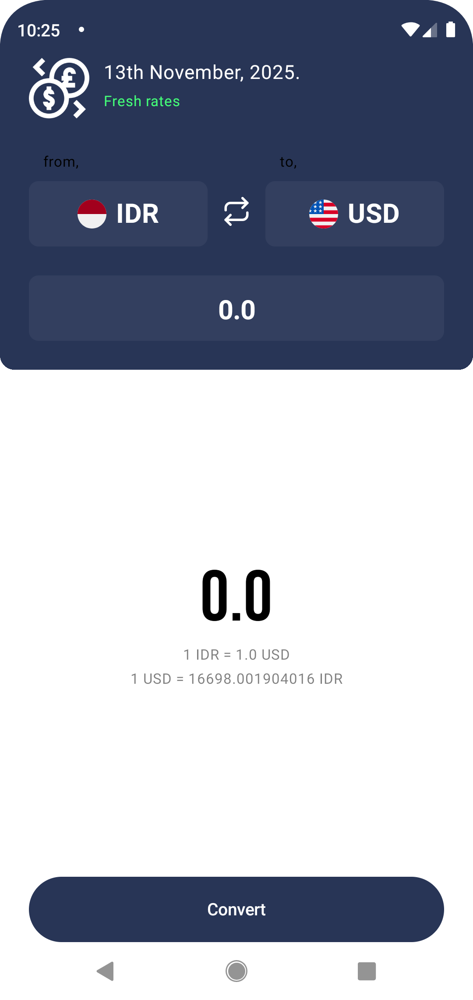
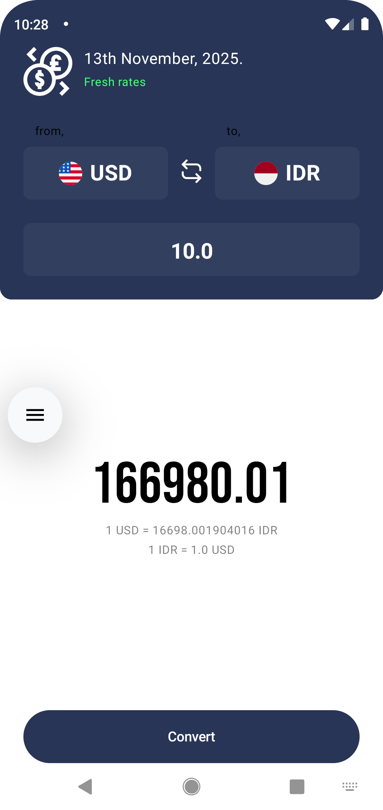

# Currency Converter App (KMP)

A modern, cross-platform currency converter application built with Kotlin Multiplatform (KMP) and Jetpack Compose Multiplatform. The app provides real-time currency conversion with an intuitive UI and offline support.

## Features

- **Cross-Platform**: Runs on Android and iOS using shared business logic
- **Real-time Conversion**: Get up-to-date exchange rates
- **Offline Support**: View previously fetched rates without internet
- **Modern UI**: Built with Jetpack Compose Multiplatform
- **Dependency Injection**: Using Koin for dependency management
- **Local Storage**: SQLDelight for local data persistence
- **Network Layer**: Ktor for API communication
- **State Management**: Custom state management with Kotlin Flows

## Tech Stack

- **Kotlin Multiplatform (KMP)**: Shared business logic across platforms
- **Jetpack Compose Multiplatform**: Modern declarative UI framework
- **Koin**: Dependency injection
- **SQLDelight**: Cross-platform SQLite database
- **Ktor**: HTTP client for API communication
- **Kotlinx.serialization**: JSON serialization/deserialization
- **Kotlinx.coroutines**: Asynchronous programming
- **Kotlinx.datetime**: Date and time utilities

## Screenshots

<div style="display: flex; justify-content: space-between; flex-wrap: wrap;">
  
  
</div>

## Getting Started

### Prerequisites

- Android Studio Hedgehog (2023.1.1) or later
- Xcode 15.0+ (for iOS development)
- Kotlin 1.9.20 or later
- JDK 17 or later

### Project Structure

```
CurrencyConverterApp/
├── composeApp/                 # Shared KMP module
│   ├── src/
│   │   ├── androidMain/        # Android specific code
│   │   ├── commonMain/         # Shared code
│   │   │   ├── kotlin/org/mzm/currencyconverterapp/
│   │   │   │   ├── data/       # Data layer
│   │   │   │   │   ├── local/  # Database and preferences
│   │   │   │   │   └── remote/ # API clients and services
│   │   │   │   ├── di/         # Dependency injection
│   │   │   │   ├── domain/     # Business logic and models
│   │   │   │   ├── presentation/ # UI components and screens
│   │   │   │   └── util/       # Utility classes
│   │   └── iosMain/            # iOS specific code
│   └── build.gradle.kts        # Shared module build config
└── iosApp/                     # iOS app module
```

### Build and Run

#### Android Application

1. Open the project in Android Studio
2. Select the `androidApp` run configuration
3. Run on an Android emulator or physical device

Or from the terminal:
- on macOS/Linux
  ```bash
  ./gradlew :composeApp:assembleDebug
  ```
- on Windows
  ```bash
  .\gradlew.bat :composeApp:assembleDebug
  ```

#### iOS Application

1. Open the `iosApp/iosApp.xcodeproj` in Xcode
2. Select a simulator or device
3. Build and run the project

### Configuration

1. The app uses a free currency exchange rate API. You may need to sign up for an API key from a provider like [exchangerate-api.com](https://www.exchangerate-api.com/)
2. Add your API key to:
   - Android: `local.properties`
   - iOS: `Configuration/Config.xcconfig`

## Contributing

Contributions are welcome! Please feel free to submit a Pull Request.

## License

This project is licensed under the MIT License - see the [LICENSE](LICENSE) file for details.

## To-Do

- [ ] Add unit tests
- [ ] Add UI tests
- [ ] Implement dark/light theme
- [ ] Add more currency conversion features
- [ ] Add historical rates view
- [ ] Add currency charts

## Contact

For any questions or feedback, please reach out to [your-email@example.com](mailto:your-email@example.com)

---

Learn more about [Kotlin Multiplatform](https://www.jetbrains.com/help/kotlin-multiplatform-dev/get-started.html)